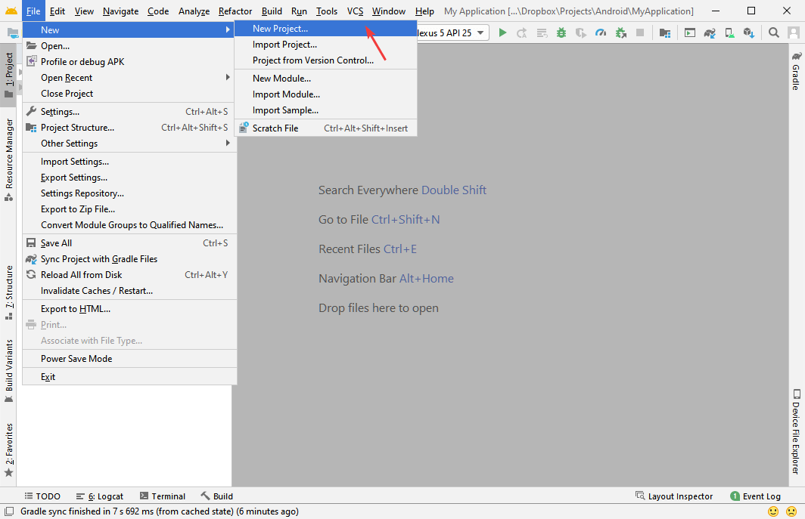
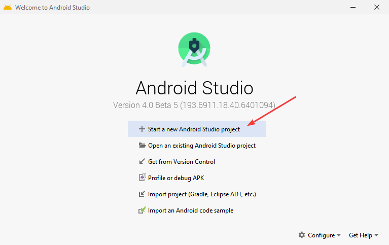
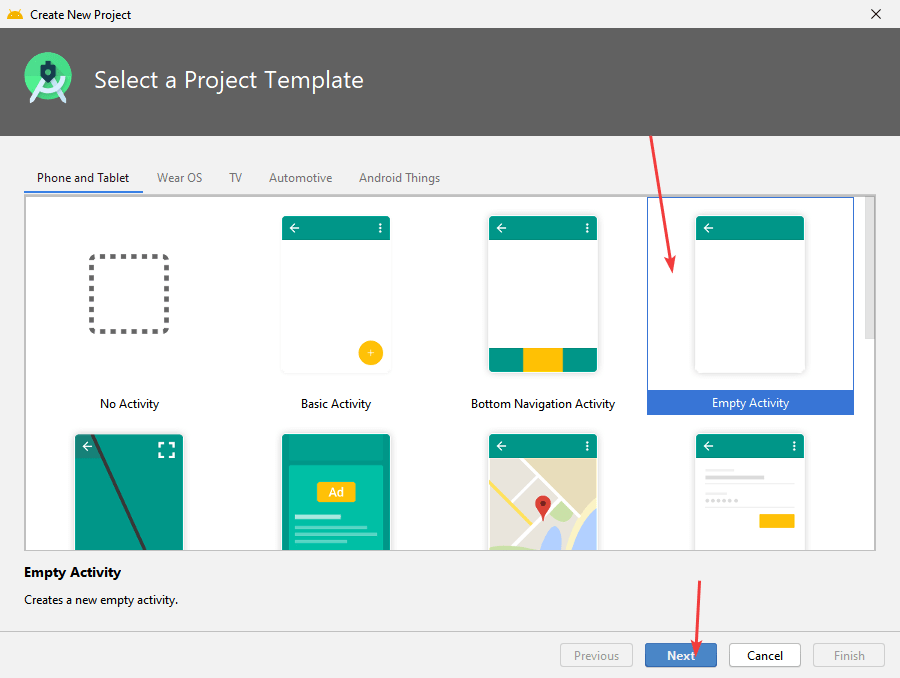
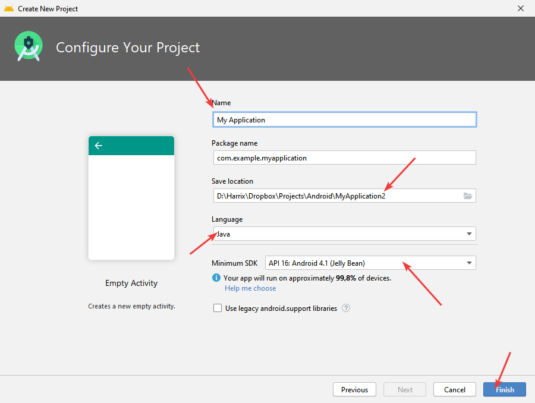
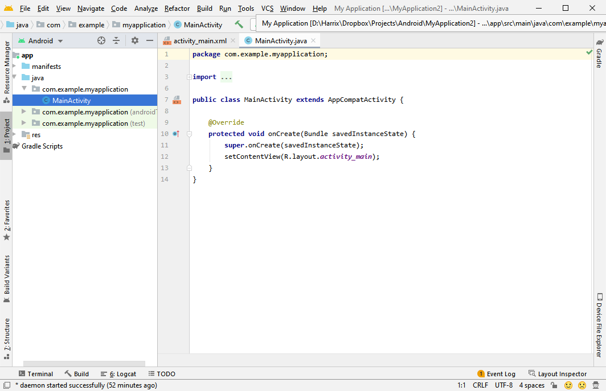
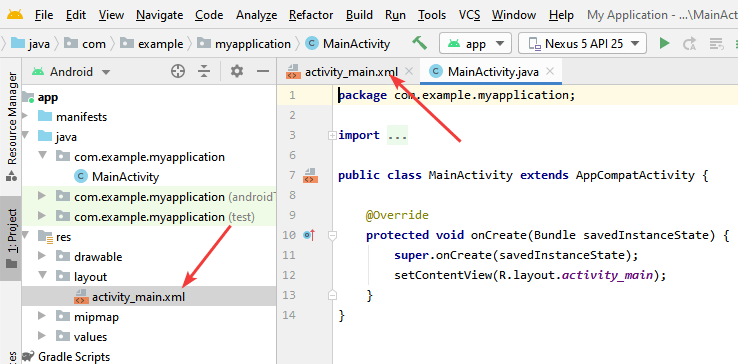
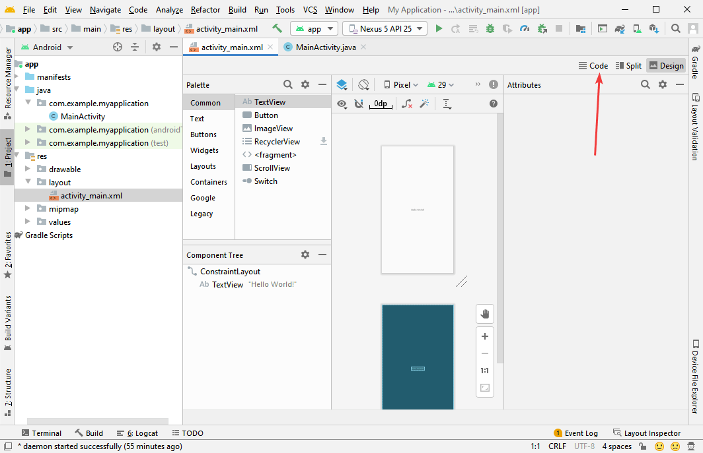
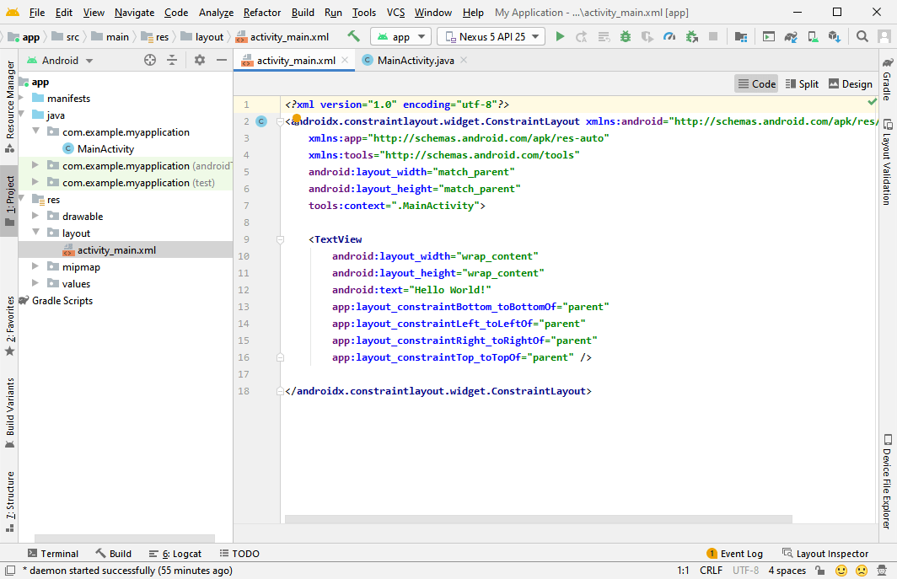
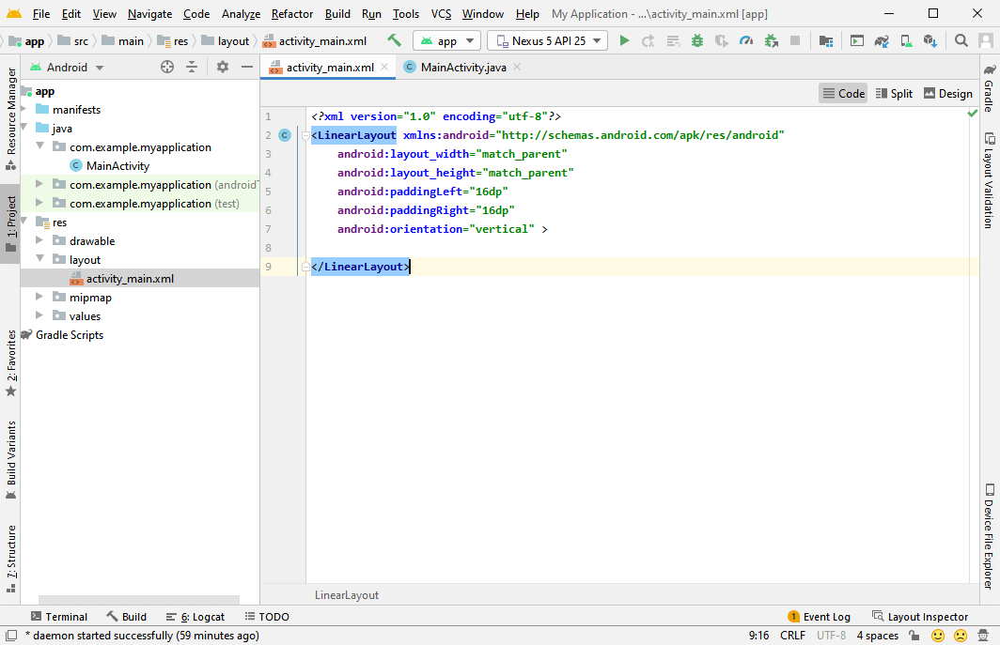

# Болванка приложения на Android Studio


В статье рассказывается как создать простую болванку на Android Studio 4.0.

Так как Android Studio часто меняет внешний вид своего приложения, то, чтобы не менять всякий раз в статьях описание создания болванки приложения, то подготовил вот эту статью.

## Приготовления

В статье [Установка Android Studio в Windows](https://github.com/Harrix/harrix.dev-articles-2019/blob/main/install-android-studio/install-android-studio.md)<!-- https://harrix.dev/ru/articles/2019/install-android-studio/ --> узнаете, как установить и настроить Android Studio.

## Создание проекта

Когда открывается Android Studio вас будет ждать такое окно (если до этого уже создавался проект):



_Рисунок 1 — Создание нового проекта_

Или будет такое окно, если, например, Android Studio открывается впервые:



_Рисунок 2 — Создание нового проекта_

Выбираем шаблон пустой активности:



_Рисунок 3 — Выбор шаблона активности_

Выбираем название проекта, его расположение, язык, на котором будет идти программирование, и минимальную версию Android для запуска приложения:



_Рисунок 4 — Выбор настроек проекта_

После этого будет создан проект приложения:



_Рисунок 5 — Готовый проект в Android Studio_

## Разметка внешнего вида

Перейдем вначале к файлу `activity_main.xml`, который отвечает за разметку внешнего вида приложения:



_Рисунок 6 — Переход к activity_main.xml_

По умолчанию в Android Studio в качестве разметки используется контейнер `ConstraintLayout`. Для новичков он не совсем простой. Поменяем на обычный `LinearLayout`.

Перейдем в текстовой режим разметки XML файла:



_Рисунок 7 — Переход к текстовому отображению activity_main.xml_

Там мы внутри контейнера `ConstraintLayout` видим элемент `TextView` с фразой `Hello, World!`:



_Рисунок 8 — Текущее содержимое файла activity_main.xml_

И заменим содержимое всего файла на следующий код:

```xml
<?xml version="1.0" encoding="utf-8"?>
<LinearLayout xmlns:android="http://schemas.android.com/apk/res/android"
    android:layout_width="match_parent"
    android:layout_height="match_parent"
    android:paddingLeft="16dp"
    android:paddingRight="16dp"
    android:orientation="vertical" >

</LinearLayout>
```



_Рисунок 9 — Новое содержимое файла activity_main.xml_

Болванка приложения готова.
